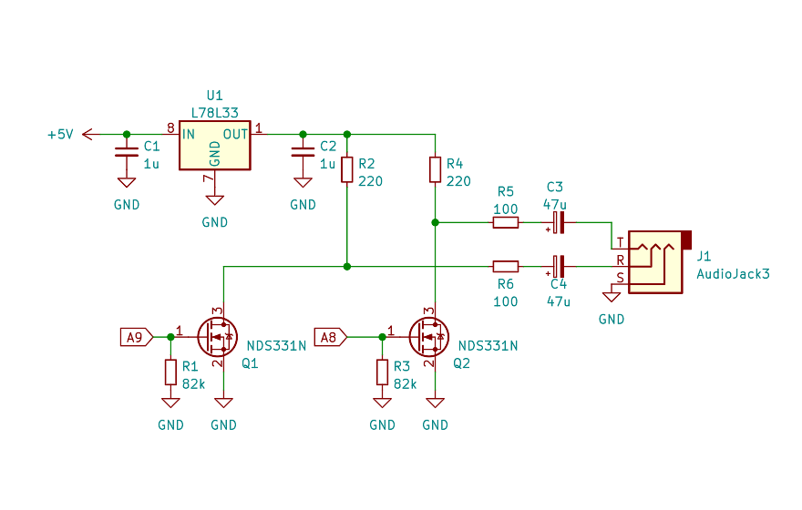
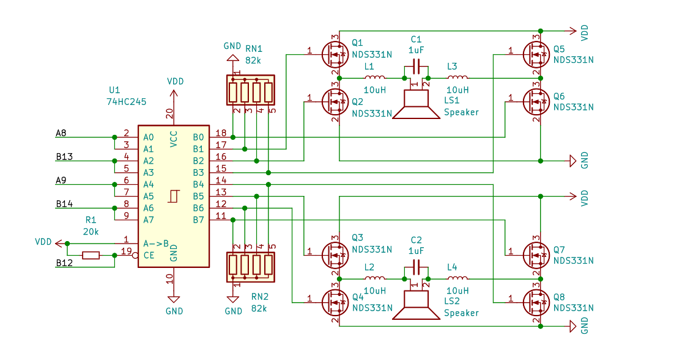

## F4UAC -- USB Audio Class headphones on STM32F4

Wait, what ? Again ? *sigh* yeah, again.

## Abstract
Loose implementation of excellent ST appnote [AN5142](https://www.st.com/resource/en/application_note/dm00477514-classd-audio-amplifier-implementation-on-stm32-32bit-arm-cortex-mcus-stmicroelectronics.pdf),
using so-called `Black Pill` [boards](https://github.com/WeActTC/MiniSTM32F4x1).

### Supported formats:

- S16_LE   @ 48000
- S24_3LE  @ 48000
- S32_LE   @ 48000
- FLOAT_LE @ 48000
- S16_LE   @ 96000
- S24_3LE  @ 96000

## Requirements
-  arm-none-eabi toolchain, i.e. from [here](https://developer.arm.com/tools-and-software/open-source-software/developer-tools/gnu-toolchain/downloads)
- [octave](https://www.gnu.org/software/octave/download) with
- [octave-signal](https://octave.sourceforge.io/signal/) extension.

## Quickstart
```
git submodule init
git submodule update
make
```

Precompiled binaries are in bin/ directory

## Pinout

Resulting PWM outputs are GPIOA8/GPIOA9 for left/right channels,
with complementary GPIOB13*/GPIOB14*.
Sample schematics for headphones:



Another one, sort of 'desktop speakers':


