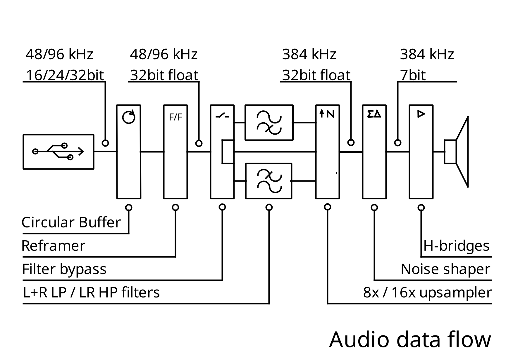
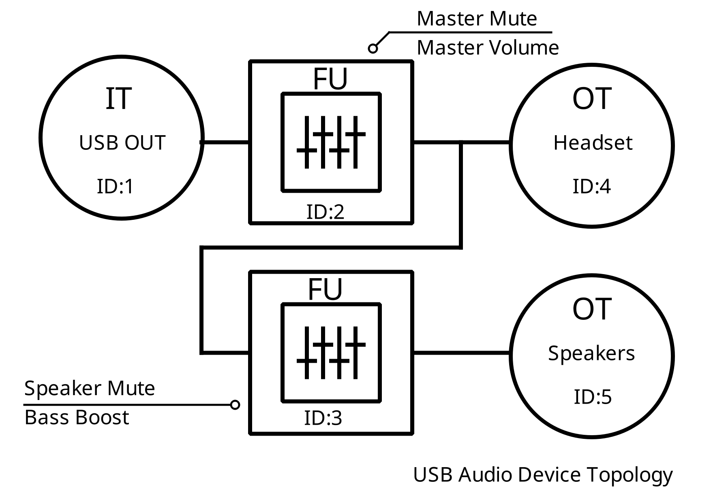
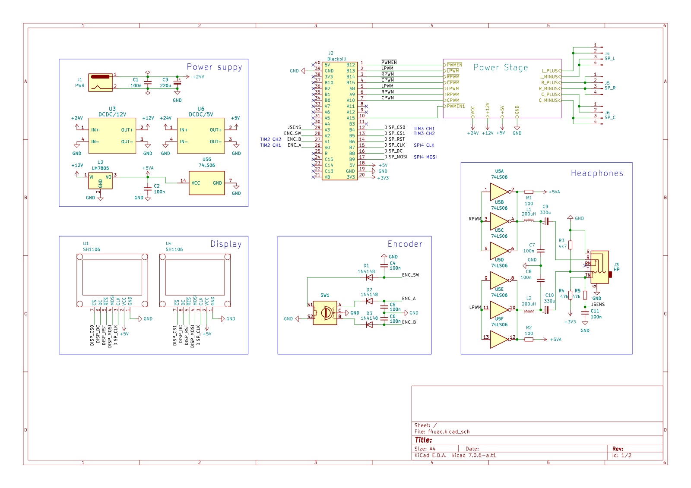
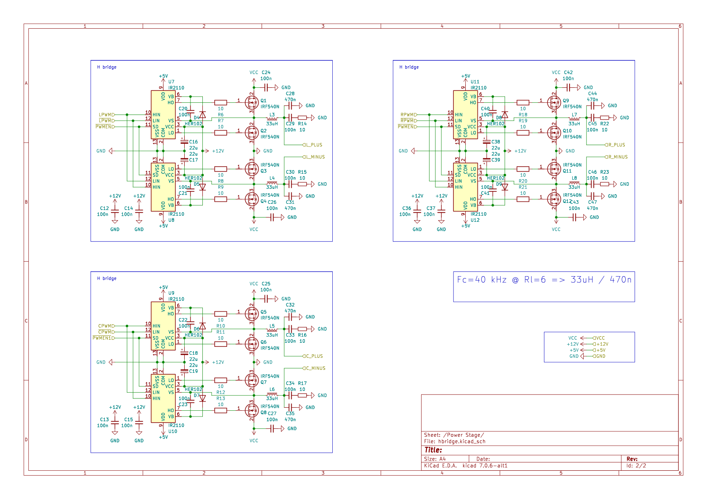

## F4UAC -- USB Audio Class headphones on STM32 MCU (-ish)

Wait, what ? Again ? *sigh* yeah, again.

## Abstract
Loose implementation of excellent ST appnote [AN5142](https://www.st.com/resource/en/application_note/dm00477514-classd-audio-amplifier-implementation-on-stm32-32bit-arm-cortex-mcus-stmicroelectronics.pdf),
using so-called `Black Pill` [boards](https://github.com/WeActStudio/WeActStudio.BlackPill).

## Description
So, USB audio on STM32. Usually this involves USB-I2S bridge,
some DAC, and maybe power stage on cheap D-class chip. Boring.
Let's do it in software (and hey, check that paper above, really).

(back ? good)

Audio data flow:



As one can see, while overall scheme remains the same, some
(let's call it) improvements exists:
- S16/S24/S32/FLOAT@44.1/48kHz and S16/S24@88.2/96kHz as input;
- optional subwoofer channel with crossover at 120 Hz;
- 8x/16x upsampler with 24/48-tap FIR interpolator;
- 4th order noise shaper;
- 7bit/384kHz PWM as output;

From USB poit of view, things are pretty straightforward:



## Requirements
-  arm-none-eabi toolchain, i.e. from [here](https://developer.arm.com/tools-and-software/open-source-software/developer-tools/gnu-toolchain/downloads)
- [octave](https://www.gnu.org/software/octave/download) with
- [octave-signal](https://octave.sourceforge.io/signal/) extension.

## Quickstart
```
git clone --recurse-submodules
make
```
Precompiled binaries are in bin/ directory

## Schematics

Resulting PWM outputs are GPIOA8/GPIOA9 for left/right channels,
with complementary GPIOB13*/GPIOB14*.
Sample schematics for headphones:


Another one, sort of 'desktop speakers':


Oh, and you can attach OLED display. Or two.
And encoder.
And proper power stage.
Anyway, here's latest:





Maybe i should consider title change.
